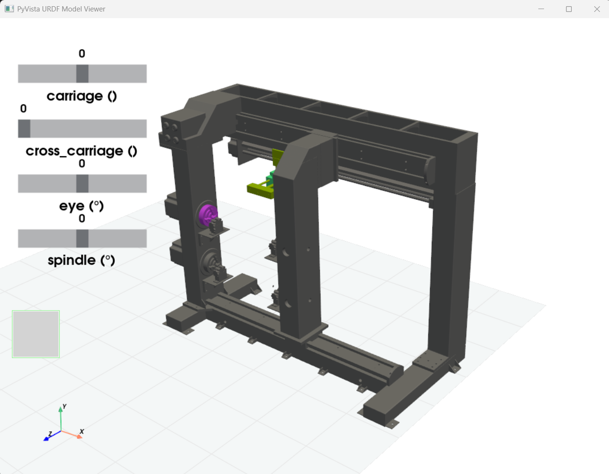

# URDF PyVista Viewer

A Python library for loading, visualizing, and interacting with URDF (Unified Robot Description Format) files using PyVista for 3D visualization.



## Features

- **URDF Loading**: Parse and load URDF files with full support for links, joints, materials, and geometries
- **Interactive 3D Visualization**: View URDF models using PyVista with real-time joint manipulation
- **Joint Control**: Interactive sliders for all actuated joints with proper limit handling
- **Link Coloring**: Color-code different links for better visualization
- **Forward Kinematics**: Real-time updates of robot configuration
- **Scene Graph Support**: Build visual and collision scene graphs
- **Mesh Loading**: Support for various 3D mesh formats (STL, OBJ, DAE, etc.)

## Installation

```bash
pip install -e .
```

## Dependencies

- numpy
- trimesh
- pyvista
- lxml
- six

## Interactive Controls

When using `robot.show()`, the viewer provides:

- **Mouse Controls**: 
  - Left-click + drag: Rotate view
  - Right-click + drag: Pan view  
  - Scroll wheel: Zoom in/out

- **Joint Sliders**: 
  - Interactive sliders for each actuated joint
  - Real-time updates of robot pose
  - Automatic unit conversion (degrees for revolute joints)
  - Reset button to return to zero configuration

- **Keyboard Shortcuts**:
  - 'r': Reset all joints to zero position

## Supported Joint Types

- **revolute**: Single-axis rotation with limits
- **continuous**: Single-axis rotation without limits  
- **prismatic**: Single-axis translation with limits
- **fixed**: No movement (excluded from controls)
- **floating**: 6-DOF free movement
- **planar**: 2-DOF planar movement

## File Structure

```
urdf_pyvista.py     # Main URDF parser and viewer
urdf_test.py        # Sample loading test (using cartesian machine model URDF sample file)
README.md           # This file
pyproject.toml      # Package configuration
```

## Example

### Basic Robot Loading
```python
import urdf_pyvista as up

# Load and display a simple robot
robot = up.URDF.load('winder_robot/winder_robot.urdf')
robot.show(color_by_link=True, sliders=True)
```

## License

This project is provided as-is for educational and research purposes.